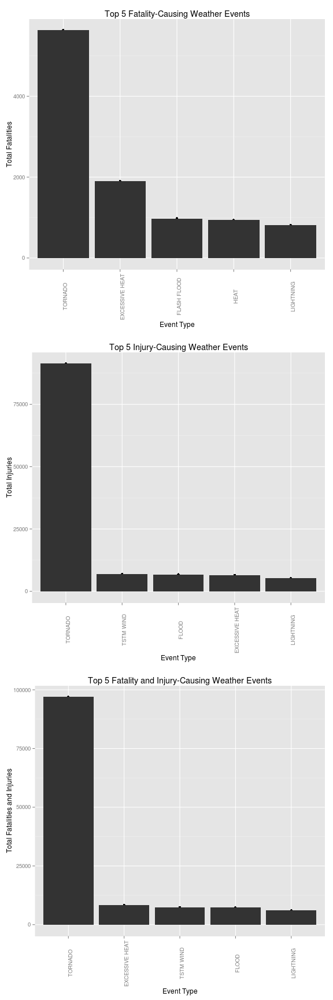
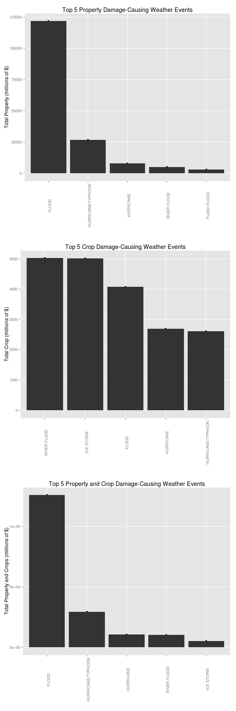

# Synopsis

This analysis uses [data](https://d396qusza40orc.cloudfront.net/repdata%2Fdata%2FStormData.csv.bz2) from the 
[U.S. National Oceanic and Atmospheric Administration's (NOAA) storm events database](http://www.ncdc.noaa.gov/stormevents/).
The objective was to determine which storms events, from 1950 to November 2011, caused the most fatalities, injuries,
property damage and crop damage. Observations with missing or undetermined values were either removed of transformed.
Our findings show that 

# Data Processing


```r
library(dplyr)
library(ggplot2)
library(grid)
library(gridExtra)
```


```r
# set number of top events to plot
top_limit <- 5

# remove rows with missing fatalies or injuries data
storm_data_by_event <- subset(storm_data, !is.na(c(storm_data$FATALITIES, storm_data$INJURIES)))

# group by event
storm_data_by_event <- storm_data_by_event %>%
  group_by(EVTYPE) %>%
    summarise(FATALITIES_TOTAL = sum(FATALITIES), INJURIES_TOTAL = sum(INJURIES), BOTH_TOTAL = sum(FATALITIES + INJURIES))

# remove rows with no data
storm_data_by_impact <- storm_data
complete_rows <- complete.cases(storm_data_by_impact[, c("PROPDMG", "PROPDMGEXP", "CROPDMG", "CROPDMGEXP")])
storm_data_by_impact <- storm_data_by_impact[complete_rows, ]
storm_data_by_impact <- storm_data_by_impact[(storm_data_by_impact$PROPDMG > 0 & storm_data_by_impact$CROPDMG > 0), ]

# convert levels to characters
storm_data_by_impact$PROPDMGEXP <- as.character(storm_data_by_impact$PROPDMGEXP)
storm_data_by_impact$CROPDMGEXP <- as.character(storm_data_by_impact$CROPDMGEXP)

# map non-numeric exponent values to numeric
storm_data_by_impact$PROPDMG[storm_data_by_impact$PROPDMGEXP %in% c("", "-", "?", "+")] <- 0  
storm_data_by_impact$PROPDMGEXP[storm_data_by_impact$PROPDMGEXP %in% c("", "-", "?", "+")] <- 0  
storm_data_by_impact$PROPDMGEXP[storm_data_by_impact$PROPDMGEXP %in% c("k", "K")] <- 3  
storm_data_by_impact$PROPDMGEXP[storm_data_by_impact$PROPDMGEXP %in% c("m", "M")] <- 6  
storm_data_by_impact$PROPDMGEXP[storm_data_by_impact$PROPDMGEXP %in% c("b", "B")] <- 9  

storm_data_by_impact$CROPDMG[storm_data_by_impact$CROPDMGEXP %in% c("", "-", "?", "+")] <- 0  
storm_data_by_impact$CROPDMGEXP[storm_data_by_impact$PROPDMGEXP %in% c("", "-", "?", "+")] <- 0  
storm_data_by_impact$CROPDMGEXP[storm_data_by_impact$CROPDMGEXP %in% c("k", "K")] <- 3  
storm_data_by_impact$CROPDMGEXP[storm_data_by_impact$CROPDMGEXP %in% c("m", "M")] <- 6  
storm_data_by_impact$CROPDMGEXP[storm_data_by_impact$CROPDMGEXP %in% c("b", "B")] <- 9  

# group by event type and conver to millions
storm_data_by_impact <- storm_data_by_impact %>%
  group_by(EVTYPE, PROPDMGEXP, CROPDMGEXP) %>%
  summarise(PROPDMG_UNSCALED_TOTAL = sum(PROPDMG) / 1000000, 
            CROPDMG_UNSCALED_TOTAL = sum(CROPDMG) / 1000000)

# scale base values by exponent
storm_data_by_impact$PROPDMG_SCALED_TOTAL = storm_data_by_impact$PROPDMG_UNSCALED_TOTAL * (10 ^ as.integer(storm_data_by_impact$PROPDMGEXP))
storm_data_by_impact$CROPDMG_SCALED_TOTAL = storm_data_by_impact$CROPDMG_UNSCALED_TOTAL * (10 ^ as.integer(storm_data_by_impact$CROPDMGEXP))

# group again by event type
storm_data_by_impact <- storm_data_by_impact %>%
  group_by(EVTYPE) %>%
  summarise(PROPDMG_TOTAL = sum(PROPDMG_SCALED_TOTAL), 
            CROPDMG_TOTAL = sum(CROPDMG_SCALED_TOTAL))

# conver NAs to 0 so as not to affect totals
storm_data_by_impact$PROPDMG_TOTAL[is.na(storm_data_by_impact$PROPDMG_TOTAL)] <- 0
storm_data_by_impact$CROPDMG_TOTAL[is.na(storm_data_by_impact$CROPDMG_TOTAL)] <- 0
storm_data_by_impact$BOTH_TOTAL = storm_data_by_impact$PROPDMG_TOTAL + storm_data_by_impact$CROPDMG_TOTAL
```

# Results

The approach of the analysis was to rank weather the top 5 weather events that caused the most fatalities, 
injuries, property damage and crop damage. By doing this, decision makers will have additional efforst to support
their planning efforts.

## Fatalities and Injuries

The following plots show the top 5 fatility, injury and combined events for the past 60+ year. For 
fatalities only, the **TORNADO** event is the most deadly with over 5500 fatalities. This is more than double **EXCESSIVE HEAT**, 
which is the second-most fatal event.

Again **TORNADO** events are the most dangerous with regards to injuries caused, with over 80,000. The **TSTM WIND**
(thunderstorms), **FLOOD** and**EXCESSIVE HEAT** events follow, all with less than 10,000 injuries.

When combine both fatalities and injuries are combined, the **TORNADO** events in not surprinsly first. The **TORNADO** event's 
combined numbers approach 100,000, more than 10x the **EXCESSIVE HEAT** event, which is a distant second.


```r
# plot fatalities
storm_data_by_event_fatalities <- arrange(storm_data_by_event, desc(FATALITIES_TOTAL))[1:top_limit, ]
p <- with(storm_data_by_event_fatalities, 
          qplot(reorder(EVTYPE, -FATALITIES_TOTAL), 
                FATALITIES_TOTAL,
                main = paste("Top", top_limit, "Fatality-Causing Weather Events"), 
                xlab = "Event Type", 
                ylab = "Total Fatalities") + 
          geom_bar(stat="identity") + 
          theme(axis.text.x = element_text(angle = 90)))

# rm(storm_data_by_event_fatalities)

# plot injuries
storm_data_by_event_injuries <- arrange(storm_data_by_event, desc(INJURIES_TOTAL))[1:top_limit, ]
q <- with(storm_data_by_event_injuries, 
          qplot(reorder(EVTYPE, -INJURIES_TOTAL), 
                INJURIES_TOTAL, 
                main = paste("Top", top_limit, "Injury-Causing Weather Events"),
                xlab = "Event Type", 
                ylab = "Total Injuries") + 
          geom_bar(stat="identity") + 
          theme(axis.text.x = element_text(angle = 90)))

# rm(storm_data_by_event_injuries)

# plot both
storm_data_by_event_total <- arrange(storm_data_by_event, desc(BOTH_TOTAL))[1:top_limit, ]
r <- with(storm_data_by_event_total,
          qplot(reorder(EVTYPE, -BOTH_TOTAL),
                BOTH_TOTAL,
                main = paste("Top", top_limit, "Fatality and Injury-Causing Weather Events"),
                xlab = "Event Type", 
                ylab = "Total Fatalities and Injuries") + 
          geom_bar(stat="identity") + 
          theme(axis.text.x = element_text(angle = 90)))

# rm(storm_data_by_event_total)

grid.arrange(p, q, r)
```

 

## Property and Crop Damage

For property damange, the **FLOOD** event was number one, with property damage approaching $125 billion. The 
**HURRICANE/TYPHOON** event was second, with significant damage totaling just over $25 billion. In third place was the
**HURRICANE**. This event could probably be combined with with the **HURRICANE/TYPHOON** event.

When looking at crop damage, the **RIVER FLOOD** (see NOAA documentation for event definitions) event was first with just over $5 billion in damage. A close second was
the **ICE STORM** with roughly $5 billion also. The **FLOOD** event, which had the most property damage, had the third
most crop damage.

Combing the damages caused to both property and crops, the top three, **FLOOD**, **HURRICANE/TYPHOON** and **HURRICANE**,  
were then as for just property. This is due to the fact that property damage values were a couple orders of magnitude 
larger than the crop damage.


```r
# plot property
storm_data_by_impact_propdmg <- arrange(storm_data_by_impact, desc(PROPDMG_TOTAL))[1:top_limit, ]
t <- with(storm_data_by_impact_propdmg, 
          qplot(reorder(EVTYPE, -PROPDMG_TOTAL), 
                PROPDMG_TOTAL,
                main = paste("Top", top_limit, "Property Damage-Causing Weather Events"),
                xlab = "", 
                ylab = "Total Property (millions of $)") + 
          geom_bar(stat="identity") + 
          theme(axis.text.x = element_text(angle = 90)))

# rm(storm_data_by_impact_propdmg)

# plot crop
storm_data_by_impact_cropdmg <- arrange(storm_data_by_impact, desc(CROPDMG_TOTAL))[1:top_limit, ]
u <- with(storm_data_by_impact_cropdmg, 
          qplot(reorder(EVTYPE, -CROPDMG_TOTAL), 
                CROPDMG_TOTAL, 
                main = paste("Top", top_limit, "Crop Damage-Causing Weather Events"),
                xlab = "", 
                ylab = "Total Crop (millions of $)") + 
          geom_bar(stat="identity") + 
          theme(axis.text.x = element_text(angle = 90)))

# rm(storm_data_by_impact_cropdmg)

# plot both
storm_data_by_impact_both <- arrange(storm_data_by_impact, desc(BOTH_TOTAL))[1:top_limit, ]
v <- with(storm_data_by_impact_both,
          qplot(reorder(EVTYPE, -BOTH_TOTAL),
                BOTH_TOTAL,
                main = paste("Top", top_limit, "Property and Crop Damage-Causing Weather Events"),
                xlab = "", 
                ylab = "Total Property and Crops (millions of $)") + 
          geom_bar(stat="identity") + 
          theme(axis.text.x = element_text(angle = 90)))

# rm(storm_data_by_impact_both)

grid.arrange(t, u, v)
```

 
